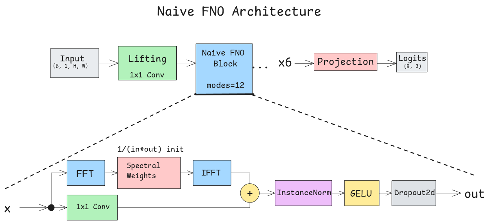
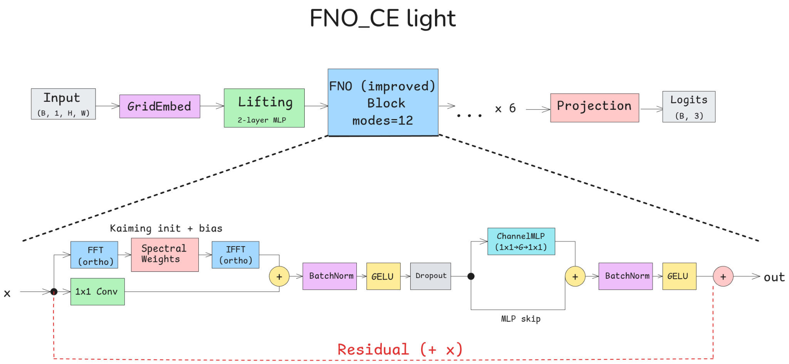
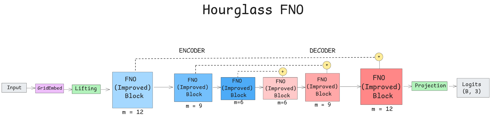
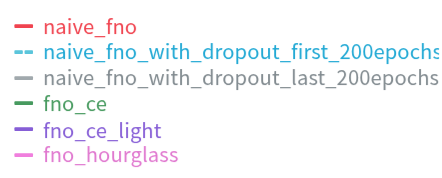
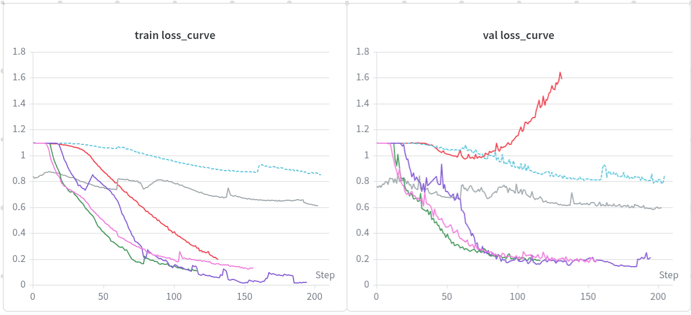

# Specific Task 4: Training Neural Operator for Image Classification

## Dataset

[Gravitational Lens Images](https://www.kaggle.com/datasets/mldtype/gravitational-lens-img)

## Weights

| Task | Weights |
|------|---------|
| Specific Task 4 (FNO) | [FNO Weights](https://www.kaggle.com/datasets/mldtype/fno-weights) |
| Common Task (ResNet-18 + SE) | [CustomNet Weights](https://www.kaggle.com/datasets/mldtype/customnet-weights) (`customnet_classification_final.pth`) |

### FNO Model Weight Files

All FNO weights are available in the [`weights/`](weights/) folder or via the [Kaggle dataset](https://www.kaggle.com/datasets/mldtype/fno-weights). The required files for each architecture:

| Model | Weight File |
|-------|-------------|
| Naive FNO | `naive_fno_f1_7259.pth` |
| FNO_CE | `fno_ce_f1_9338.pth` |
| **FNO_CE_Light** | `fno_ce_light_f1_9555.pth` |
| FNO_Hourglass | `fno_hourglas_f1_9408.pth` |

> Common task notebook is available in the [`common_task/`](common_task/) folder.

## Introduction

This task explores using Fourier Neural Operators (FNO) for image classification on gravitational lensing data. The dataset consists of gravitational lensing images across three classes: **No Substructure**, **Sphere (subhalo) Substructure**, and **Vortex Substructure**.

The dataset is organized into train and validation splits. The train set is further divided into 90% for training and 10% for validation. Final evaluation metrics are reported on the held-out validation set.

**Evaluation Metric**: ROC curve, AUC score

## Model: Fourier Neural Operator (FNO)

Three architectural variants were systematically tested:

1. **Naive FNO** - Minimal FNO implementation: input passes through stacked spectral blocks where each block performs FFT → learned spectral weights → IFFT, combined with a parallel 1x1 convolution. Uniform weight initialization and InstanceNorm. This sets the baseline score for FNO.

2. **FNO (Improved)** - Building over the naive version with added positional encoding and skip connections mimicking ResNet. This implementation is inspired by the current version in the neuraloperator library. The lifting layer introduced MLP-based channel level mixing. Moved from uniform to Kaiming initialization of weights (faster convergence). Tested with two frequency modes = 14, 12. `fno_ce_light` has modes = 12.

3. **FNO Hourglass** - An encoder-decoder variant where Fourier modes are progressively reduced in the encoder (12 → 9 → 6) and restored in the decoder (6 → 9 → 12). Skip connections link encoder and decoder stages at corresponding resolution levels. This design creates an information bottleneck in frequency space, analogous to U-Net's spatial bottleneck, achieving competitive performance with approximately half the parameters compared to FNO_ce_light (4M vs 7M).

## Training Configuration

| Setting | Value |
|---------|-------|
| Loss Function | CrossEntropy |
| Learning Rate | 1e-4 (initial), higher rates (~8e-4) worked better for FNO |
| Scheduler | StepLR (cosine annealing caused loss spikes) |
| Regularization | Spatial dropout = 0.1 (for Naive FNO) |

## Results

| Architecture | #params | Additional Training Config | Val F1 Score | Val micro avg AUC Score | Classwise AUC |
|--------------|---------|---------------------------|--------------|------------------------|---------------|
| ResNet-18 + SE Blocks | 13.6M | NA | - | 0.9908 | no: 0.9905, sphere: 0.9824, vort: 0.9936 |
| Naive FNO | 7.1M | Spatial dropout = 0.1, cosine annealing scheduler | 0.73 | 0.9019 | no: 0.9666, sphere: 0.8276, vort: 0.8893 |
| FNO | 9.7M | Modes = 14 | 0.93 | 0.9909 | no: 0.9954, sphere: 0.9808, vort: 0.9912 |
| FNO_light | 7.1M | Modes = 12 | 0.96 | 0.9954 | no: 0.9972, sphere: 0.9901, vort: 0.9960 |
| FNO_Hourglass | 4.3M | NA | 0.94 | 0.9918 | no: 0.9957, sphere: 0.9830, vort: 0.9925 |

**Best AUC achieved by FNO_ce_light (0.9954).**

*Note: Common task metrics have been corrected here; apologies this was not updated in the proposal.*

## Details

### Discussion

- Started with naive FNO to establish baseline behavior. With 16 modes and no regularization, the model quickly overfit on the training data. The train-val gap pointed to overcapacity rather than data mismatch, as both distributions were similar.

- Reducing modes from 16 to 12 and adding spatial dropout removed overfitting. Initial runs used ~1e-4 with cosine annealing. FNO performed better at higher rates (~8e-4), while cosine restarts caused loss spikes. Hence for following runs switched to higher lr and StepLR scheduler.

- However, naive_FNO converged around 0.73 F1 score (less than the CNN baseline). On comparing, two things were noted: FNOs have no sense of position and unlike ResNet, naive FNO has no skip connection.

### Key Observations

- FNO requires positional information and skip connections
- Higher learning rates work better for FNO
- Hourglass architecture is parameter efficient - competitive performance at ~50% parameter count suggests frequency bottlenecks are viable for this task

### Architecture Diagrams

#### Naive FNO

#### FNO Improved (FNO_CE light)

#### FNO Hourglass

### Training Curves

